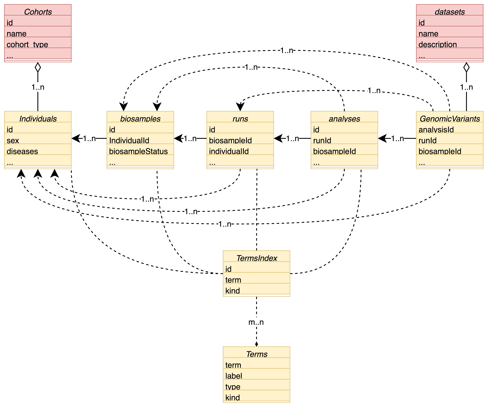
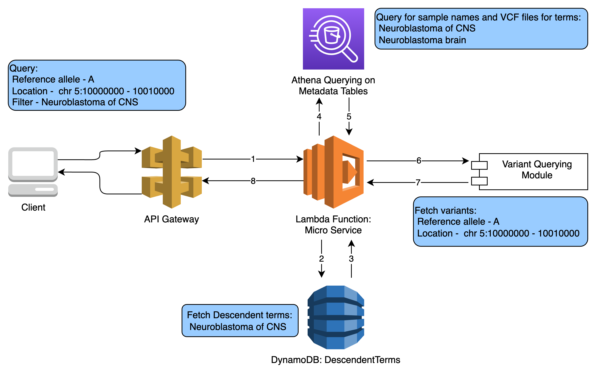
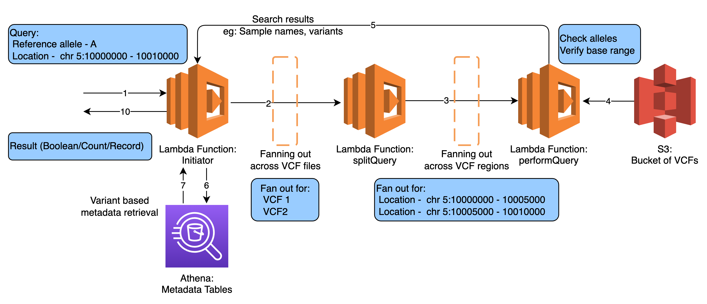
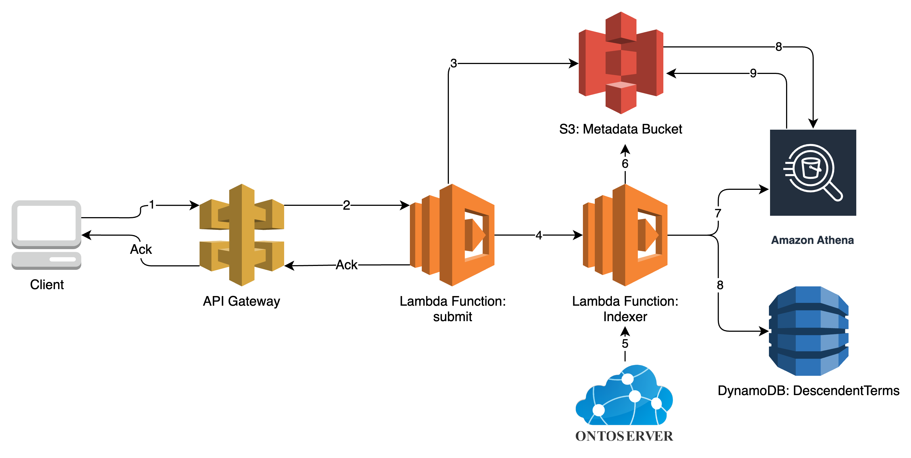

# Serverless Beacon Architecture

sBeacon is a cloud-native solution compliant with GA4GH Beacon v.2, designed for genome-phenome queries. It supports population-scale cohorts and offers an economical entry for smaller organizations into the Beacon Network.

Beacon schema outlines multiple entities and schemas for these are provided [here](../shared_resources/schemas/). Official documentation is available [here](https://beacon-project.io). API docs are [here](http://docs.genomebeacons.org). You can also find a reference implementation [here](https://b2ri-documentation.readthedocs.io/en/latest/).

This documentation specifically outlines the complexities associated with the implementation of sBeacon.

## Entity Relationships

Entities are related in the following form.

## Querying Module

Querying takes place using the following architecture. Note that DynamoDB is used as a simple yet efficient lookup table to expand ontology codes to retrieve descendent terms as needed for querying.

## Variant Querying Module

Variant querying module is used by other querying modules to enable variant perusal as needed to satisfy the user query.

## Ingestion and Indexing

Ingestion and indexing of data in the sBeacon takes place as below.

Note that, the `ACK` refers to the acknowledgement as indexing can take place asynchronously, or after few ingestion rounds for maximum efficiency.
